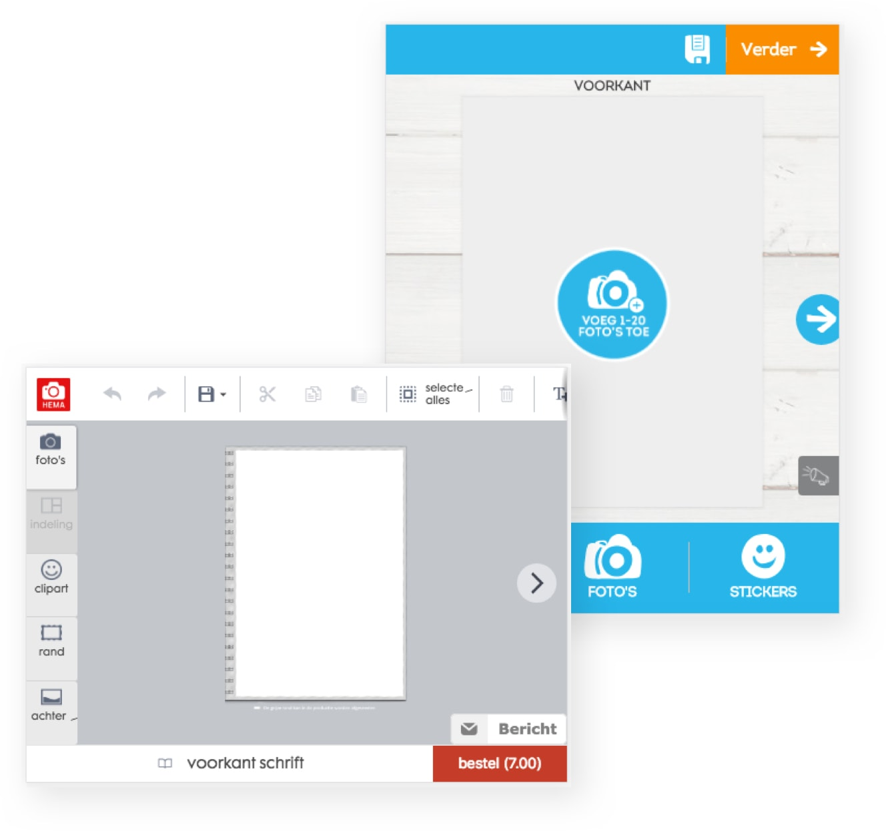
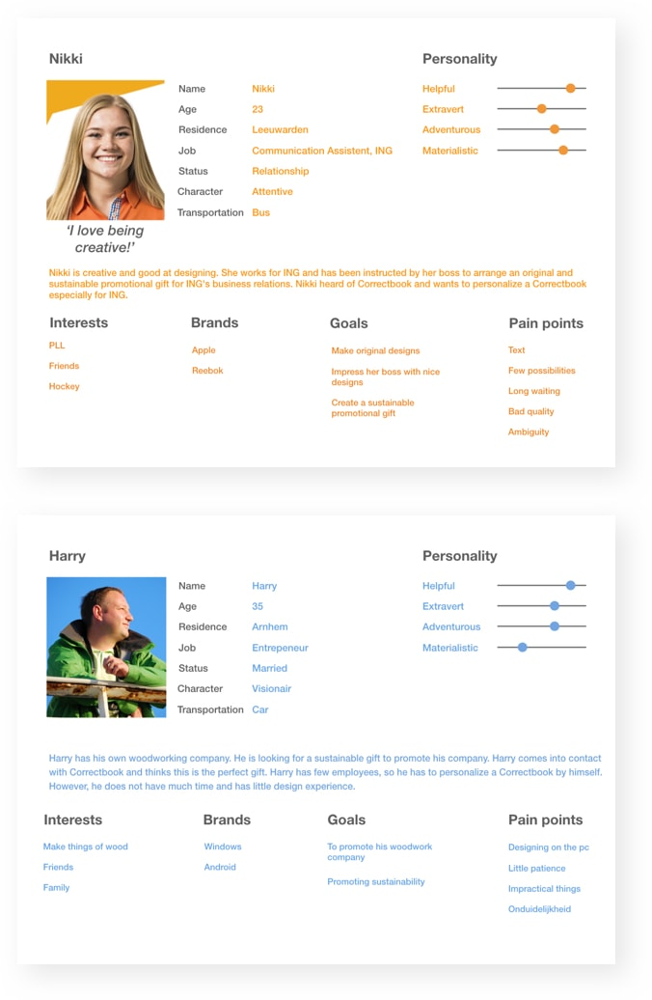
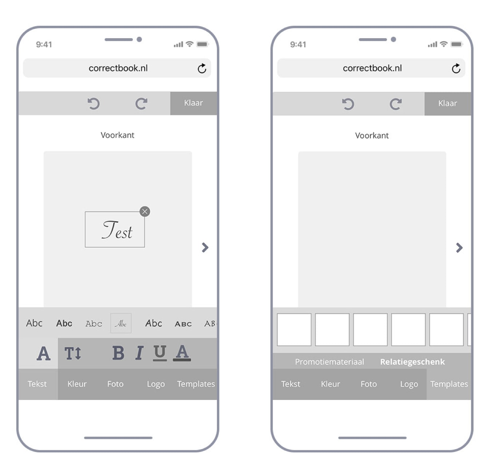
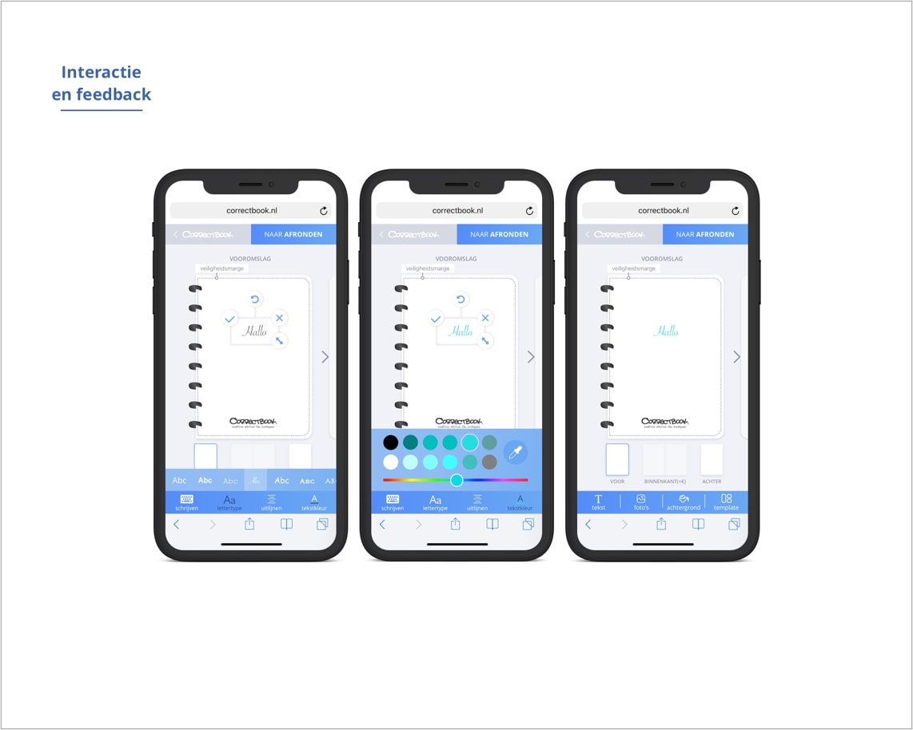
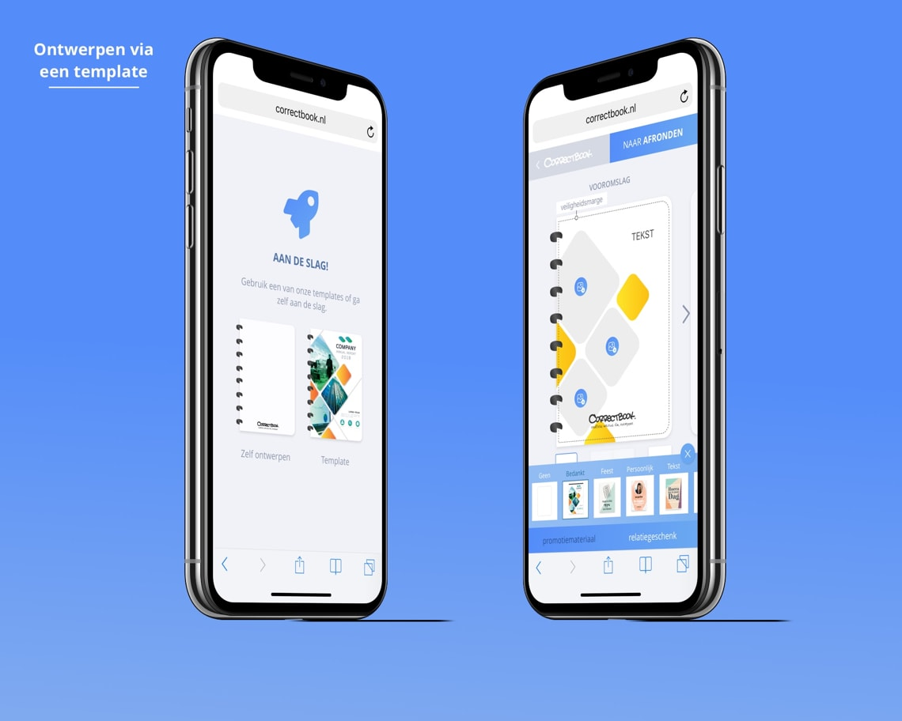

## The problem

**The option to customize a Correctbook is, at the moment, an obstructive process that takes a lot of steps and time which makes it unattractive for companies to purchase their customized Correctbooks.**

In the current flow, companies can request a quotation on the Correctbook website. Next, Correctbook asks for a detailed design to be sent or, on request, makes a design if the company itself has little design experience. This flow is not ideal for both parties. 

- Requesting a quote is a threshold for customers, because it is unclear how this process works and what the possibilities are in the design
- The process takes a long time 
- It takes Correctbook a lot of time to create designs at the customer's request, which limits the number of customers that can be served at the same time

---

## The challenge

**Create a designtool, accessible to companies with and without design experience, so that all companies can design and order their own Correctbooks.**

Not all customers of Correctbook have the ability or skills to make their own design. Therefore, the designtool should focus on different types of users with varying designexperience.

Because more than half the visitors of correctbook.com visit the site by using their mobile device, Correctbook asked us to design a mobile-first design tool. 

---

## Method

**To find out what the tool should or should not contain, we conducted five interviews and tested comparable services (e.g. Hema, Fotofabriek, Greetz etc.) with the interviewees.**

Because there is already a big market in customizing products, we choose to conduct competitive research and test these services with the interviewees. During the test the the interviewees were asked to personalize a Hema notebook or Greetz card and to think out loud while performing their tasks. Through observation of their behaviour, asking what, how, which, why questions and making notes, we got the first early insights.

---

## Understand the user

**The user tests showed that users had different needs for guidance during the design of their own correctbook. They also needed a constant overview of the design options and direct feedback of changes to the design.**

Because the need for design guidance among the customers varied, we collected and analyzed the data to define persona’s and their goals and painpoints. This resulted in two persona’s: Nikki and Harry. These two were opposite to each other in terms of design skills and pain points. 

Users also reported a need for overview and direct feedback. Customizing a product on a website where you could design step by step by scrolling and indicating your preferences, was very unclear to users. They forgot what they had chosen or changed and could not see the result untill the end.

Finally, users wanted to try out the design options as quickly as possible in the tool. There were often too many steps (number, size, interior) before they could start designing.

---

## Prototyping and testing

**Based on the results of the test and the paintpoints in the current userflow, we made sketches and wireframes of the tool. We choose to show designoptions and direct feedback on one page, the give users the possibility to choose guidance, and to minimalize the steps before entering the designtool.**

After multiple tests, iterations and refinement, we made a final design. Because the tool was designed for customers, we opted for a clean and minimal design using the colours and font matching the house-style of Correctbook.

#### Overview and feedback
Users wanted to make changes immediately and wanted direct feedback. We solved this by constantly showing the cover that the user is designing on one page while making it interactive. Text, photos, background color or templates can be added via a bar at the bottom of the screen. When a part is changed, the bar only shows the options to further modify the selected part.

#### Choose for guidance or design yourself
In order to achieve our goal and make the tool accessible to users with and without design experience, we decided to give two design options: self-design or design using a template. With a template, for example, users with little design experience can easily create a beautiful design because the options are limited and recorded. The user only needs to adjust the text, color and image by clicking on the template. To guarantee a beautifull design without much knowledge of quality standards, we decided that users will receive a warning when the quality of a file is too low to make a beautiful design. This warning will disappear if the file is modified or deleted.

#### Minimalizing choices before design tool
Users wanted to try out the designtool options as quickly as possible. We have therefore opted to have the customer make only essential choices, such as size and pattern of the inside, before the customer actually goes into the tool to customize their Correctbook.

By implementing the design tool, the threshold to order customized Correctbooks is reduced. Companies now have control and insight into the entire design and design process and have their own design delivered twice as fast. Correctbook is no longer responsible for the end result and saves a lot of time they can put into increasing their impact against illiteracy.

