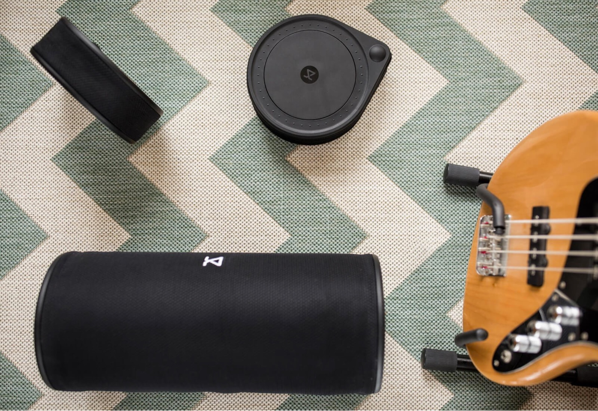
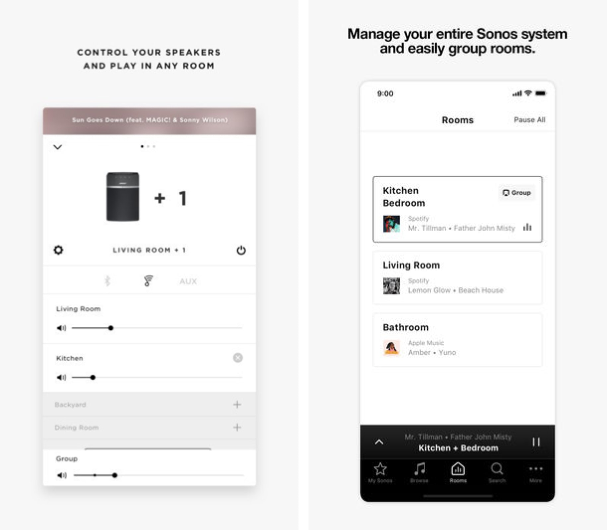
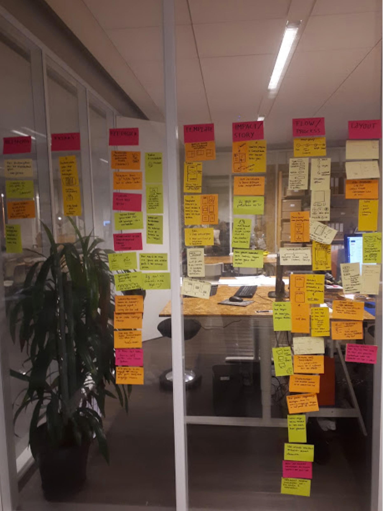
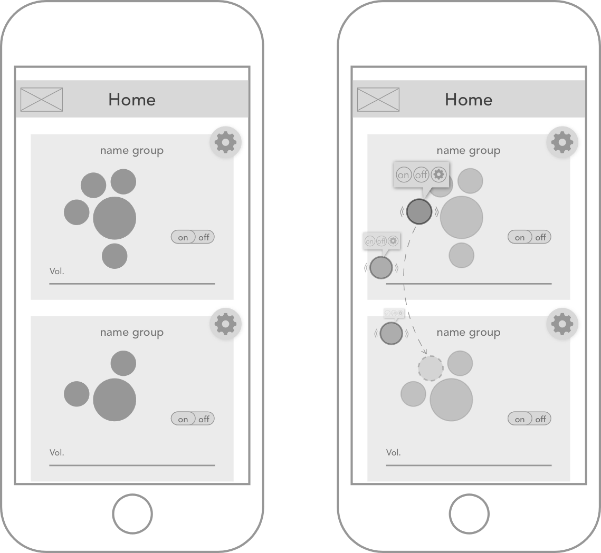
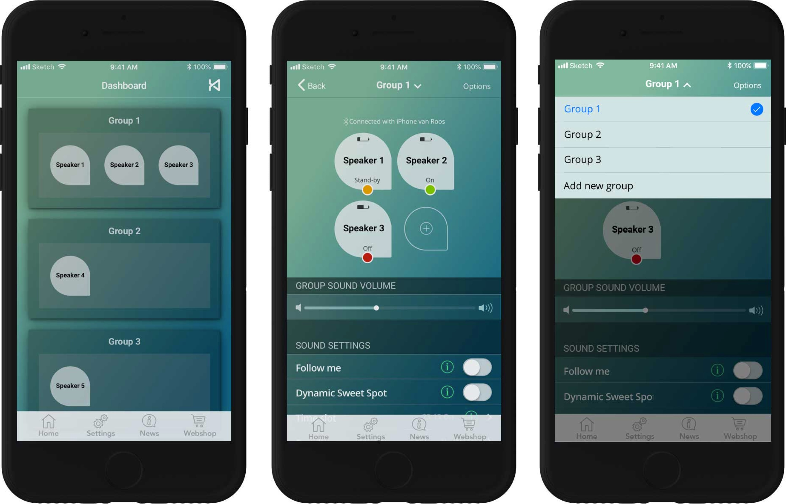
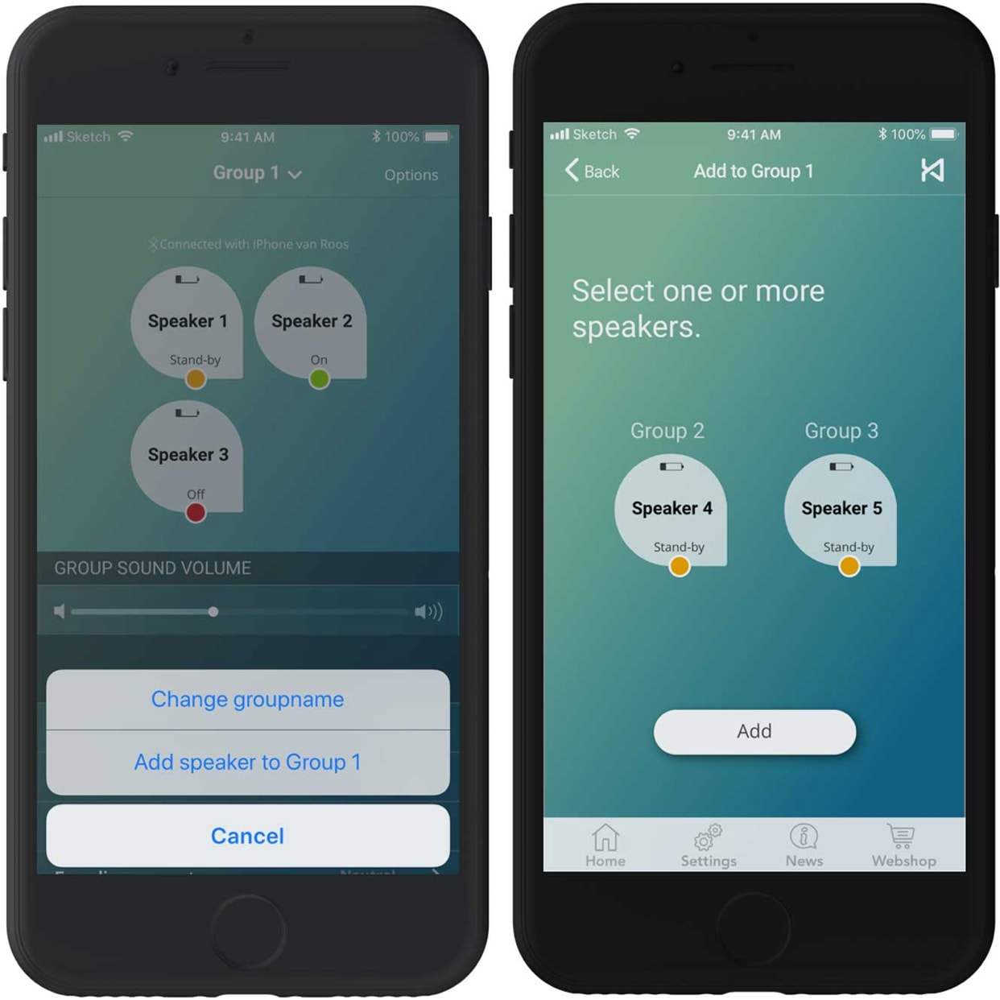
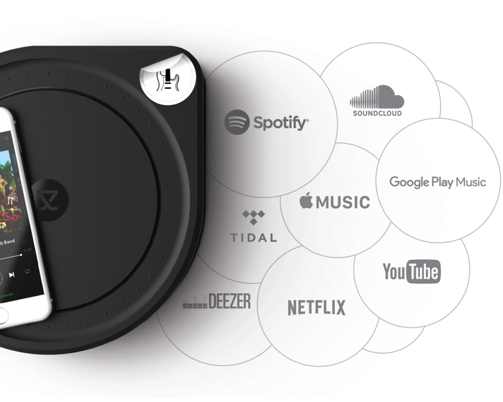

## The problem

**Because the Kien speakers are so flexible, users lose track of which speakers form groups and which speakers are on or off. The current app gives little or no insight about this.**

When a user has several Kien speakers at home, the speaker can be connected to a group by tapping the speakers together and also be disconnected this way. The speakers can be put anywhere, as long as they are connected to your phone via bluetooh. Unfortunately, users seem to lose sight of the overall picture. This is due to the following problems:

- Changes in groupformation of speakers are reflected in the Kien app but users do not seem to understand the current interface of the App.
- The speakers physically do not show which ones form groups. All speakers look the same. Because of this, and the current interface of the app, users quickly lose track of group formation with or without the App.
- Users lose track of the status (on/off) of the speakers. The App doesn’t provide information about this, and users find it difficult to check this on the speakers when they are scattered around the house.

---

## The challenge

**A redesign of the Kien app to provide a better overview of the formation of groups and status of the speakers. Also creating an additional design element to the speakers to identify them physically but also in the app.**

After after a redesign of the app there still would be a problem. Even with the app, users won’t be able to tell physically which speaker formed a group or was on/off because all the speakers looked the same. I concluded that an additional physical design element had to be added to the speakers in order to distinguish the speakers from eachother and provide a useful overview.

---

## Method

**To research the paintpoints of users and oppertunities for improvent of the Kien app, I conducted five interviews and usabilitytests and conducted C & C research.**

During the interviews, I asked users how they use their speakers and in which situations they wanted to use it. I also asked them what they expected from the Kien app and what they experienced as good or bad features. Finally, I asked how the app could be of added value for them.

While testing the Kien app, users were asked to look up and interpret information about the speakers in the Kien app. Users were also asked to change speaker settings. Through observation and taking notes of their experience, I got a sense of which challenges the users faced.

I also analyzed comparable apps (e. g. Bose and Sonos) to find out how they provided overview of multiple speakers. 

---

## Understand the user

**The interviews showed that users wanted the app to be a control panel, so they can manage their speakers fully through the app. Usabilitytests showed that users experienced the app as too technical and that many unique features were hard to find.**

The interviews and usability tests showed that:

- The current app mainly focuses on the underlying technology.
- The app provides unclear information about the composition of the groups. Users reported a need for a better overview.
- Users can not manage their speakers and groups via the app, except for sound settings. They reported a need to move speakers to another group and change the composition of the groups in the app. Users also wanted insight and control over which speaker is on, off or on standby.
- The app contains a number of extra unique sound settings that are difficult to find for the user at the moment. 

The results of the analysis of compatible apps were:

- The apps compatible with Kien showed a brief overview of the groups, but did not show which speakers belonged to which group.
- Groupsettings were quick to find and could easily be adjusted, but with the settings of individual speaker settings this was difficult.
- Special settings were also difficult to find, as with the Kien app.
- The status of the speakers were not displayed, similar with the Kien app.

Therefore, I hope to redesign the Kien app so that users can quickly and easily get an overview of the groups and individual speakers, and can also control them through the app.

---

## Prototyping and testing

**In order to meet the reported needs of users, I choose to create an interactive dashboard to provide overview and controle of the status and groupformation of the speakers. After multiple iterations of usertests and refinement, the app provided a simple non-technical overview, clear information about the groups and controle over the speakers.**

First I started sketching and making wireframes based on the results of the analysis of the interviews and tests. Because users thought the speakers were interactive, I concluded that, by tapping on the speaker, it should be possible for users to turn the speaker on/off or change it’s settings. In addition, I was inspired by the way you can drag and drop apps on your iPhone. Implementing this in the Kien dashboard, made it possible for users to add or remove speakers from groups by ‘drag-and-drop’ them from one group to the other (as shown in the wireframe below). User could change the groupsettings by tapping on the setting symbol top right.

During five usertests, it was found that this wasn’t the perfect set-up for users, because the design needed too much explanation. Although it was clear for users how to turn speakers on or off, users didn’t easily understand the drag and drop feature. In addition, important settings were still hidden and it was unclear for users how to create new groups.

I used the feedback obtained from the usertests and analyzed how I might solve these problems they were facing. With adjustments and iterations I refined the user experience design of the Kien app and added a visual design matching the technical feel of the speakers. It resulted in the following solutions.

#### Dashboard and clear navigation

It was difficult for users to see which groups existed, so I chose to create a dashboard in which the user first could see an overview of the different groups. From this dashboard the user can go to the desired group with one click. From here the status of the speakers, the composition of the groups and several unique group settings are viewed and can be adjusted. I have omitted or simplified information that caused confusion by prioritizing important information and putting important or fun features in the foreground. To keep an overview but also keep navigating to other groups easy, I chose to add a dropdown that allowed users to go to other groups or create a new group.

#### Add speakers

Because kien is a fluid system, unlike Sonos or Bose, it was necessary to be able to remove speakers from groups or to place them in other groups. Based on usertests, I chose to view this feature in the foreground, by adding an icon. This feature is also accessible via 'options' where you can also change the name.

#### Distinguish speakers with unique stickers

The problem that speakers couldn’t physically be distinguished now still derailed the newly created overview in the redesigned app. To solve this problem, I choose to add unique stickers to the speakers that corresponded with an icon in the Kien app. Now users could see the speaker in their house, and check in their app which group this speaker belonged to and whether the speaker was on or off. With stickers the user also retains freedom to distinguish speakers by either don’t use the sticker, apply the stickers or adjust them.

Due to the renewed display, users reported less ambiguity and more control over the speakers and overview of the available functionalities. These functionalities were also became easy accessible. This way, users could enjoy the Kien speakers even more.
