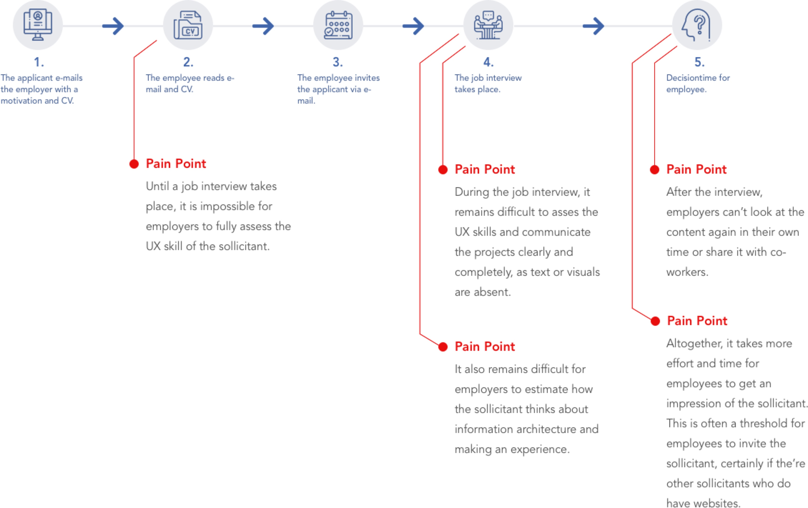
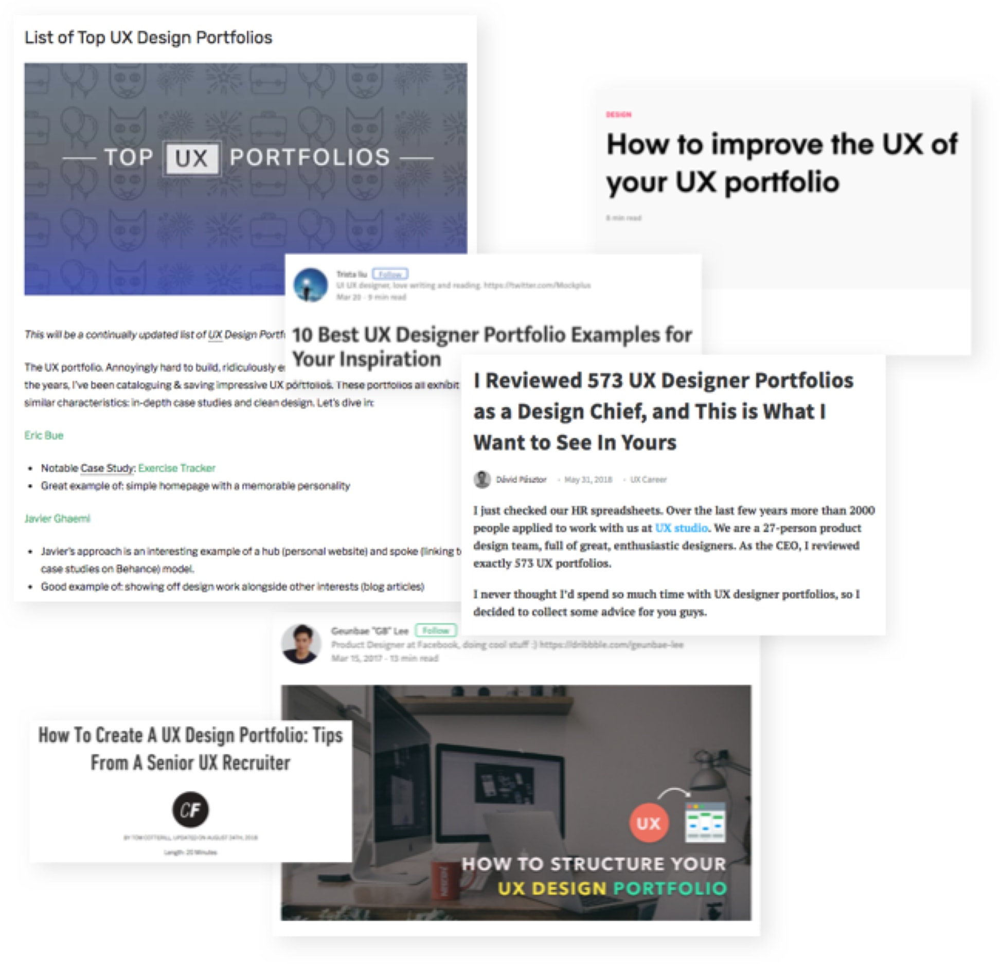
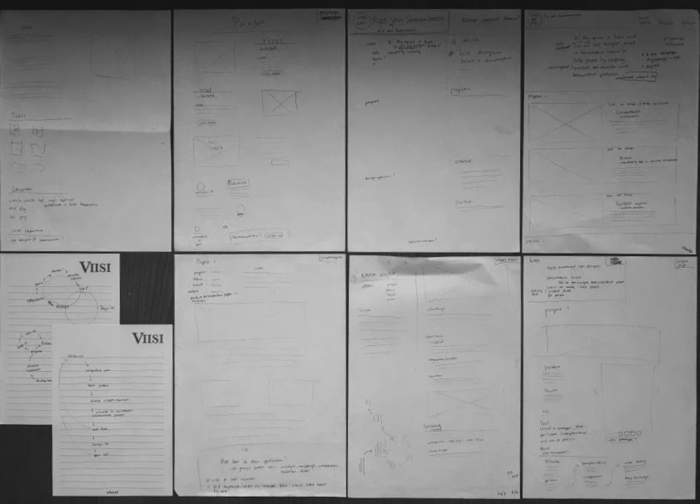
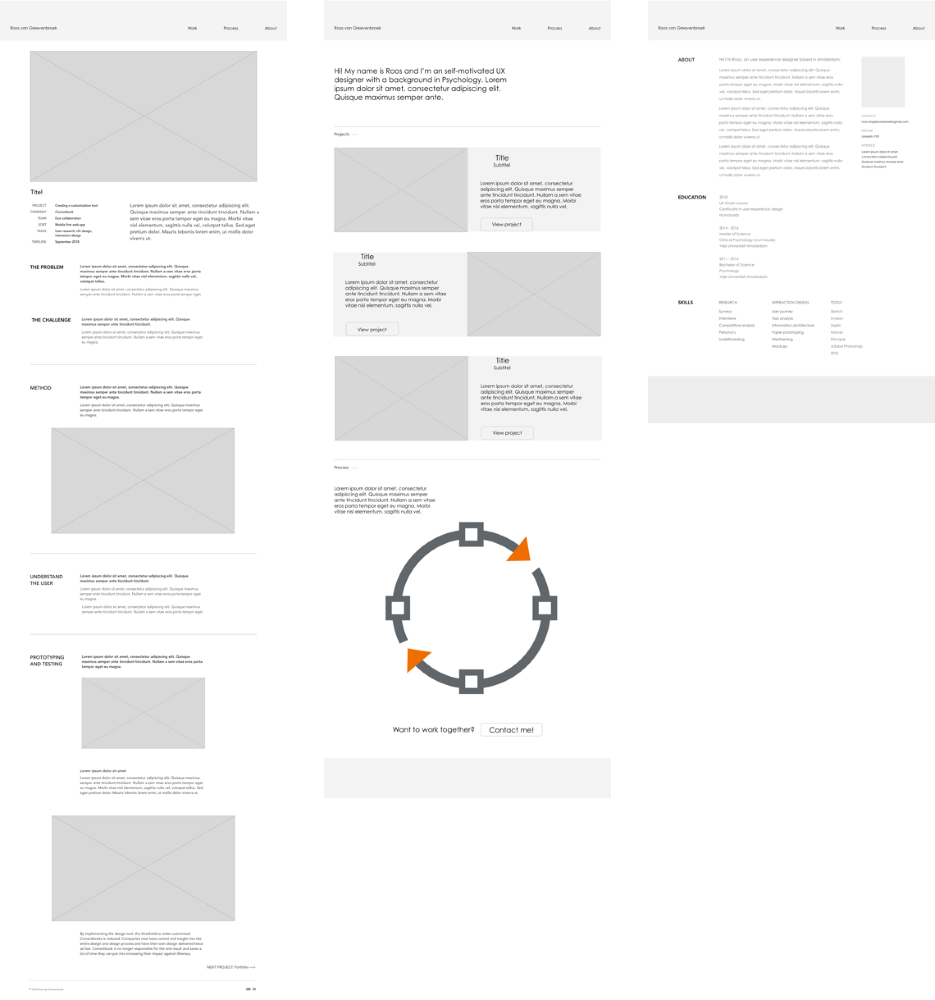

## The problem

**Not having a online portfolio forms multiple barriers in finding new colleagues to work with and interesting projects to work on for either future employees and sollicitants.**

Not having a online portfolio forms multiple barriers in finding new colleagues to work with and interesting projects to work on for either future employees and sollicitants.

---

## The challenge

**Creating a portfolio website myself, without templates, to practice my skills and show what I have to offer. The website must be adapted to the people who visit the site and to a lot of content.**

The website has to be adapted to people with need for in-depth info or just quick scanning, since future visitors often have little time. There is also a lot of content on the website, so the challenge is to organize this in such a way that employees do not become overstimulated as a reader.

Because employees visit portfolio sites often by using their mobile device or iPad, the website has to be responsive. 

---

## Method

**To determine how the website should be built up, I reviewed blogs about needs of recruiters and conducted C & C research among portfoliowebsites.**

First, I analyzed 6 blogs of UX recruiters an design chiefs about what they needed to see in UX portfolio’s. This way it was possible to search purposefully in portfolios of other UX-ers to what would, or wouldn’t, be good solutions to present yourself and your work. I choose to analyse 50 best chosen personal UX portfolio’s of 2017 and 2018 and their reviews from Design chiefs. 

I also analyzed ‘portfolio’ websites of reputable companies in the UX sector. Through observation of these websites, I got early insights in how to present yourself and your work in a clear and scannable way according to the needs of the readers of the website.

---

## Understand the user

**The C & C research and reviews of recruiter blogs showed that recruiters needed a overview on the first page to get a first impression, were they had the oppertunity to dig in deeper. They also needed to see the what, how and why of a project.**

First of all, recruiters indicated that they have little time to review portfolio’s and therefore needad a certain stratification in the information. The landing page should contain a little bit of everything, so recruiters can get a first impression of the person and their skills. If the’re interested, they want to dig deeper into the case studies. 

At the page of the case study, recruiters want to see the what, how and why. What the problem is about, how this will be solved, and why particular decisions were made. Here, recruiters also wanted to see the designproces and shared user insights. Still, because recruiters have little time, information about the case study should also be stratisfied as well so they can scan.

What they don’t want to see is:
- Requesting a quote is a threshold for customers, because it is unclear how this process works and what the possibilities are in the design
- Lack of context about the projects. Recruiters need a intro of the project before they dig deeper into it.
- Copy without any hierarchy. Recruiters need clear headlines, subheadings etc, so they can scan through the page and have a good sense of what’s it about.

---

## Prototyping and testing

**Based on the user insights and with the painpoints of the current flow in mind, I first sketched different options of all pages. I tested which options best suited the needs of the user. After multiple iterations, the final design contained scannable and stratified information with the emphasis on the designstory.**

With the results of the research and analysis in mind, I worked out different solutions for problems in different pages. I experimented with adding and omitting certain information to be able to test what was found most essential. In addition, I experimented with different ways how the information was displayed to test which way felt the most intuitive for users. 

During 5 reviews of the sketches, I got insight into which options and parts of solutions users preferred:

**What users liked about the home page:**
- Short intro of me and why I choose UX.
- The context information about the projects: for who, what was it about, my role and my goal.
- A visual representation and brief outline of my designprocess and how this relates to psychology.

**What users liked about the project page:**
- Short intro of the company and the project objectives.
- An explanation about the problem, method, results and designdecisions.
- Alternating text with visuals.

**What users liked about the about page:**
- In-depth information about my way into UX and how I am in person and in a work-environment.
- Contact info.
- An small overview of important information in my resume.

With the user feedback as a guide, I further developed the solutions in wireframes. During a couple of iterations and usertests, I found out that users needed the content on the project page needed to contain more headlines, short paragraphs and bullits to make it more readable. I redesigned the project page with clear headlines and bullits and added a paragraph with bold letters to each headline that summarized the essence of the chapter. This way, people with little time could only read the bold letters to understand the basics of the project.

Finally, I also added some design details inspired by one of my favorite artists Yves Klein, to make the clickable elements clearer.

In order to test whether the site would meet recruiters' needs enough, I conducted five user tests in which users were given 3 minutes to get a picture of me and my skills. After the 3 minutes, a check was made to see whether this matched correctly. The user tests showed that users found the website clear and scannable. In addition, users could form an accurate picture of me and my skills in a short time. 

Using Zeplin, I handed off my design to developer Floris Koch, who build this site on Gatsby JS. 

